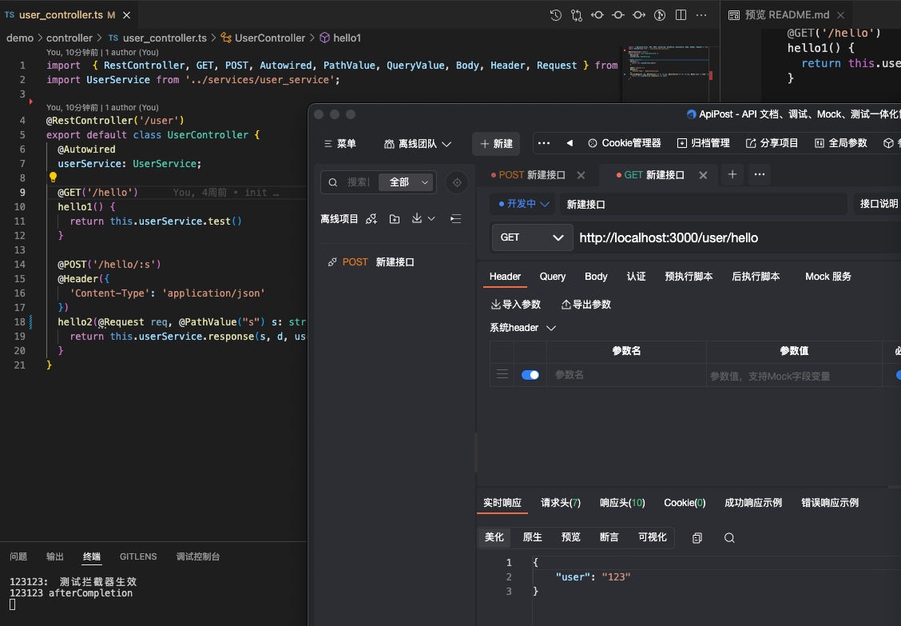
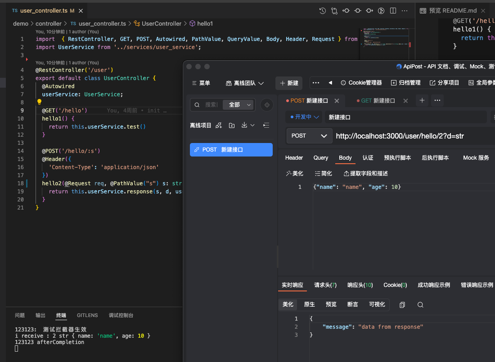

使用装饰器模拟spring的注解以及内部的运行机制，个人娱乐

核心在core文件夹下，测试代码在demo文件夹下

通过装饰器，模拟了springboot中的注解，包括：

*类级别*： RestController, Configuration

*方法级别*：HttpMethod, GET, POST, PUT, DELETE, PATCH, RequestMapping, Header

*属性级别*：Autowired

*参数级别*：Body, Request, PathValue, QueryValue


使用方法：


Controller层:
``` typescript
@RestController('/user')
export default class UserController {
  @Autowired
  userService: UserService;

  @GET('/hello')
  hello1() {
    return this.userService.test()
  }

  @POST('/hello/:s')
  @Header({
    'Content-Type': 'application/json'
  })
  hello2(@Request req, @PathValue("s") s: string, @QueryValue("d") d: string, @Body user: { name: string, age: number }) {
    return this.userService.response(s, d, user)
  }
}
```

Service层：
``` typescript
export default class UserService {
  public async test() {
    return {
      user: '123'
    }
  }
  public response(s: string, d: string, user: any) {
    console.log('i receive :', s, d, user)
    return {message: 'data from response'}
  }
}
```

拦截器：
``` typescript
@Configuration
export default class MyConfig implements WebConfig {
  addInterceptors(registry: InterceptorRegistry): void {
    registry.addInterceptor(new TestInterpotor())
      .addPathPatterns('/**')
  }
  addCorsMappings(registry: CorsRegistry): void {
    registry.addMapping("/**")
      .allowCredentials(true)
      .allowedMethods(HttpMethod.GET, HttpMethod.DELETE, HttpMethod.PATCH, HttpMethod.POST, HttpMethod.PUT, HttpMethod.OPTIONS)
      .allowedHeaders('Content-Type', "token")
      .allowedOrigins("*")
      .maxAge(2000)
  }
}

// 测试拦截器
export default class TestInterpotor implements HandleInterceptor {
  // 同步处理
  preHandle(req: IncomingMessage, res: ServerResponse, handle: any): boolean {
    console.log('123123: ', '测试拦截器生效')
    return true
  }

  // 异步处理
  // preHandle(req: IncomingMessage, res: ServerResponse, handle: any): Promise<boolean> {
  //   console.log('123123: ', '测试拦截器生效')
  //   return new Promise(r => {
  //     setTimeout(() => {
  //       r(true)
  //     }, 3000);
  //   })
  // }
  afterCompletion(req: IncomingMessage, res: ServerResponse, handle: any): void {
    console.log('123123', 'afterCompletion')
  }
}
```

同时还有模拟Springboot的 **全局异常捕获**，**拦截器**等等配置，具体的可以查看demo文件夹

运行效果：
> Get接口测试

> POST接口测试

